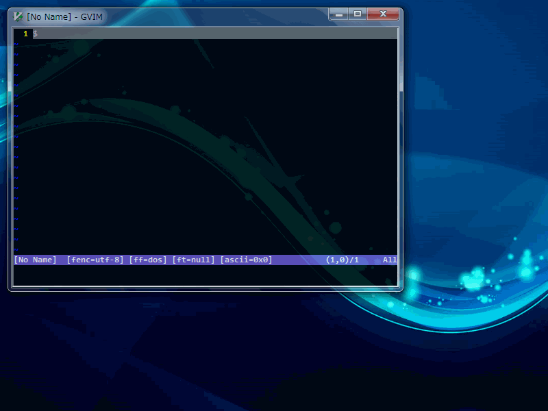

movewin.vim
=====

This plugin enables resizing window without mouse.  
After loading the script, do command :ResizeWin. Use hjkl and shift+hjkl keys to move the window, press any other key when done.  
If you want to maximize window, do command :FullSize. The command: 'FullSize' is a toggle command, so after maximize the window,
do command :FullSize again, you can restore oeiginal window size.  
This plugin can be used in CUI and GUI.  





#### Key-bind Interface
This plugin provides interface for key-bind.  
You can use it as follow.  

```VimL
nmap <S-Left>   <Plug>(resizewin-contract-x)
nmap <S-Down>   <Plug>(resizewin-expand-y)
nmap <S-Up>     <Plug>(resizewin-contract-y)
nmap <S-Right>  <Plug>(resizewin-expand-x)
map  <F11>      <Plug>(resizewin-full)
map! <F11>      <Plug>(resizewin-full)
map  <M-F11>    <Plug>(resizewin-full)
map! <M-F11>    <Plug>(resizewin-full)
```


If you want to change the expansion/contraction width/height, set your favorite values to global variables as follow.

```VimL
let g:resizewin#resize_width  = 3  " the default value is 1.
let g:resizewin#resize_height = 3  " the default value is 1.
```


## Install
If you use [NeoBundle](https://github.com/Shougo/neobundle.vim "NeoBundle") for a plugin manager,
write following code in .vimrc and do command :NeoBundleInstall.

```VimL
NeoBundleLazy 'koturn/resizewin.vim', {
      \ 'autoload' : {
      \   'commands' : ['ResizeWin', 'FullSize'],
      \   'mappings' : [
      \     '<Plug>(resizewin-contract-x)',
      \     '<Plug>(resizewin-expand-y)',
      \     '<Plug>(resizewin-contract-y)',
      \     '<Plug>(resizewin-expand-x)',
      \     '<Plug>(resizewin-full)',
      \]}}
```

If you use other plugin manager or don't use it, I'm sorry, but please install this plugin on your own.
